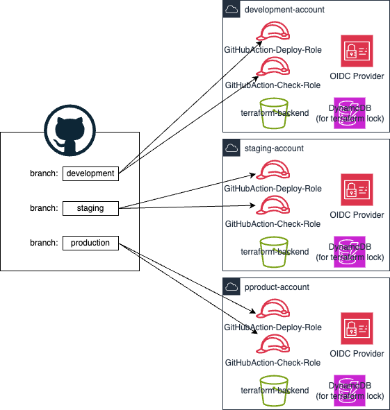

# Terraform Pipeline サンプル

このリポジトリは、Terraformを使用してインフラストラクチャをコードとして管理するためのパイプラインのサンプルです。

## 前提条件
### ブランチ戦略
このサンプルはブランチ戦略として、gitlab-flow戦略を採用することを前提としています。

## 使用方法

### 1. GitHub Actionによるパイプライン構築
AWSとのIAMプロバイダーによる認証連携から、GitHub Actionの設定までの手順は以下を参照ください。
- [GitHub Actions および Terraform セットアップ手順](./documents/initial_setup/README.md)

### 2. GitHubレポジトリの保護
複数人数で開発するときのGitHubレポジトリへのガードレール設定について、以下のドキュメントを参照ください。
- [GitHubでの大規模開発におけるレポジトリ保護手順](documents/github_repository_protection/README.md)

## 貢献
貢献を歓迎します。バグ報告やプルリクエストを通じて貢献してください。

## ライセンス
このプロジェクトはApache License Version 2.0ライセンスの下でライセンスされています。
