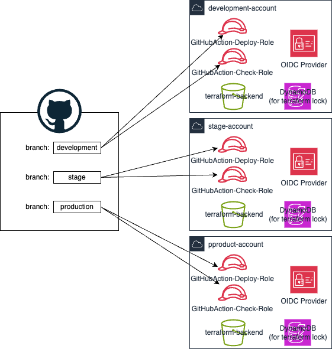

# GitHub Actions および Terraform セットアップ手順

## 構成イメージ


## 手順概要

本ページでは、GitHub Actions を実行し Terraform の plan までが動作するところまでの設定手順を説明します。
GitHub Actions による CI 環境は大きく以下の流れでセットアップを進めます。

1. 前提の確認
1. Actions および Terraform に必要な AWS リソースの作成
1. Terraform の修正
1. GitHub Actions の動作テスト

## 前提の確認

セットアップの前提として以下が完了していることを確認します。

1. AWS アカウントの初期セットアップが完了していること
1. 作業環境がMacOSであること(zshシェル利用前提の手順のため)
1. AWS CLI が利用可能な作業環境であること
   1. AWS CLI のインストールは[こちらを参照](https://docs.aws.amazon.com/cli/latest/userguide/getting-started-install.html)
   1. 設定方法は[こちらを参照](https://docs.aws.amazon.com/ja_jp/cli/latest/userguide/getting-started-quickstart.html)
   1. `AdministratorAccess`権限で実行可能なこと
1. (Option) GitHub CLI が利用可能なこと
   1. GitHub CLI のインストールは[こちらを参照](https://github.com/cli/cli?tab=readme-ov-file#installation)

## Actions および Terraform に必要な AWS リソースの作成

GitHub Actions にて該当 AWS 環境にアクセス可能にするため、OIDC プロバイダーと、Actions から AssumeRole される IAM ロールを作成します。また Terraform で必要となるバックエンド用の S3 バケットとロック用の DynamoDB テーブルを作成します。

具体的には以下のリソースを作成します。

- IAM OIDC プロバイダー: `https://token.actions.githubusercontent.com`
- IAM ロール:
  - `GitHubAction-Deploy-Role`
  - `GitHubAction-Check-Role`
- Terraform のバックエンド
  - S3 バケット: `TunnelVpc-terraform-backend` (\*1)
  - DynamoDB テーブル: `TunnelVpc-terraform-lock-state` (\*2)
- KMS キー(S3 バケット/DynamoDB 暗号化用): `alias/Key-For-Terraform`

(*1) バケット名は、スタック作成時のパラメータで変更可能です。
(*2) テーブル名を変更する場合は、CloudFormation テンプレートの`TableName`部分を更新ください。

## OIDC プロバイダー/IAM ロール/S3 バケット/DynamoDB テーブル作成

### 事前準備

zsh でコメントアウトを有効にします。

```shell
setopt interactivecomments
```

### ３環境のブランチ名とAWS CLIプロファイル名の設定
ブランチ名を連想配列のkeyにして、各環境のAWS CLIのプロファイル名を手動設定します。
```shell
typeset -A PROFILE=()
PROFILE[development]="<dev環境のAWS CLIプロファイル>"
PROFILE[staging]="<staging環境のAWS CLIプロファイル>"
PROFILE[production]="<production環境のAWS CLIプロファイル>"
```

AWSアカウントIDの設定を行います。
```shell
typeset -A ACCOUNT_ID=()
for branch in ${(k)PROFILE}
do
	ACCOUNT_ID[$branch]=$(aws --profile ${PROFILE[$branch]} --output text \
    sts get-caller-identity --query 'Account')
done
```

ブランチ名、AWS CLIプロファイル、該当環境のAWSアカウントIDが認識通りかを確認します。
```shell
echo "<<<<<Check values>>>>>>"
for branch in ${(k)PROFILE}
do
	printf 'branch = %-15s profile = %-15s account id = %-12s\n' ${branch} ${PROFILE[$branch]} ${ACCOUNT_ID[$branch]}
done
```

### OIDCプロバイダーとGitHubかのフェデレーション用IAMロール及びterraform用のS3バケット&DynamoDB作成
以下の(1)-(3)の、OIDCプロバイダ作成とCloudFormationによるリソース作成は、３環境それぞれ実行します。

#### (1)環境設定
環境ごとにブランチ名を設定します。
- 開発環境の場合
```shell
branch=development
```
- ステージング環境の場合
```shell
branch=staging
```
- 本番環境の場合
```shell
branch=production
```

#### (2)OIDC プロバイダーの作成

AWS CLI で OIDC プロバイダーを作成します。(CloudFormation では、ThumbprintList が自動生成されないため CLI を利用)

```shell
aws --profile ${PROFILE[$branch]} \
    iam create-open-id-connect-provider \
        --url "https://token.actions.githubusercontent.com" \
        --client-id-list "sts.amazonaws.com";
OIDC_PROVIDER_ARN="arn:aws:iam::${ACCOUNT_ID[$branch]}:oidc-provider/token.actions.githubusercontent.com"

# OIDCプロバイダーの確認
aws --profile ${PROFILE[$branch]} \
    iam get-open-id-connect-provider \
        --open-id-connect-provider-arn "${OIDC_PROVIDER_ARN}"
```

#### (3)IAM ロール/KMS/S3 バケット/Dynamodb の作成

CloudFormation を利用し、GitHub Actions からの AWS アクセスおよび Terraform に必要なリソースをデプロイします。

<設定概要>

- テンプレート: `./initial_setup/github_role_s3_dynamodb_for_terraform.yaml`
- スタック名: `github-action-and-terraform-resources`
- パラメータ:
  - `GitHubOrganizationsName` : 本リポジトリの所有者を設定。所有者が組織の場合は GitHub Organization 名を指定。所有者が個別アカウントの場合は、アカウン名を設定する。
  - `GitHubRepositoryName` : リポジトリ名。このサンプルではこのリポジトリの名前(`TerraformPipelineSample`)をデフォルトで設定している。
  - `BranchName` : 該当環境用のGitHub Action実行時のブランチ名。このテンプレートでは、`development`, `staging`, `production`から選択できるようにしている。環境に合わせて適時テンプレートを変更すること。
  - `OidcProvider`: 作成した OIDC プロバイダーの ARN の指定

<注意事項>
- CloudFormationテンプレートは、利用環境に応じて修正してください。
- テンプレートの削除やアップデート時にリソースを削除するか残すかを指定する`DeletionPolicy`と`UpdateReplacePolicy`は、このテンプレートでは学習や検証用に一時的にデプロイして利用することを想定して`Delete`指定にしています。本番運用の場合は`Retain`を指定するようテンプレートの見直しをお願いします。

<CloudFormation のデプロイ>
CloudFormationのテンプレートをデプロイします。
```shell
aws --profile ${PROFILE[$branch]} cloudformation deploy \
    --stack-name "github-action-and-terraform-resources" \
    --template-file "./src/cfn/github_role_s3_dynamodb_for_terraform.yaml" \
    --parameter-overrides OidcProvider="${OIDC_PROVIDER_ARN}" BranchName="$branch" \
    --capabilities CAPABILITY_NAMED_IAM ;
```

デプロイしたスタックに削除保護設定を行います。
```shell
aws --profile ${PROFILE[$branch]} cloudformation update-termination-protection \
    --stack-name "github-action-and-terraform-resources" \
    --enable-termination-protection;
```

## GitHub 設定
### (GUI操作)環境用ブランチの作成
環境用の以下の３つのブランチを、`main`ブランチから作成する

<作成するブランチ>
- `development`
- `staging`
- `production`

<作成方法>
- 該当レポジトリの`Code`で`Branches`に移動する
- 右上の緑色のボタン`New Branch`を押し、`main`ブランチから３つのブランチを作成する。

### (GUI操作)GitHubリポジトリに各環境のenvironmentを準備する
<作成する環境>
- 作成するEnvironment一覧
  - <code>development</code>
  - <code>staging</code>
  - <code>production</code>

<手順>
1. ブラウザでGitHubの該当リポジトリに移動する
1. リポジトリ上部の<code>Settings</code>タブを開く
1. 右のペインから<code>Environments</code>を選択し
1. <code>New environment</code>ボタンを押す
1. <code>Name</code>に上記で示したそれぞれの環境名を入力して、<code>Configure environment</code>ボタンを実行して環境を作成する

### (CLI操作)GitHubリポジトリに各環境のenvironmentを準備する

- GitHubへのログイン
```sh
gh auth login --git-protocol https --hostname github.com --web
```

- environmentごとにsecretsでAWS_ACCOUNT_IDを設定
```sh
for branch in ${(k)PROFILE}
do
  gh secret set AWS_ACCOUNT_ID --body ${ACCOUNT_ID[$branch]} --env ${branch}
done
```

## Terraform 修正

### バックエンド設定の変更内容の説明

Terraform のバックエンドで利用する S3 バケットを、CloudFormation で作成したリソースに設定します。
具体的な設定ファイルは以下となります。

- 対象ファイル: 
  - development環境: `sample_project/envs/development/backend.tf`
  - staging環境: `sample_project/envs/staging/backend.tf`
  - production環境: `sample_project/envs/production/backend.tf`

環境に応じて以下の通り守成します。
```hcl
terraform {
  backend "s3" {
    bucket = "CloudFormationスタックの`TerraformBackendSeBucketName`の値を設定"
    key    = "sample_project/terraform.tfstate"
    region = "ap-northeast-1"

    dynamodb_table = "terraform-lock-state"
  }
}
```

<設定箇所>

- `bucket` : CloudFormation`setup-github-and-terraform`スタックの出力の`TerraformBackendSeBucketName`の値を設定
- `dynamodb_table` : CloudFormation`setup-github-and-terraform`スタックの出力の`TerraformLockStateTableName`の値を設定

### 設定値の取得

(1) Terraform backend 用 S3 バケット名称の取得

```shell
echo "TerraformBackendSeBucketName = $( \
  aws --profile ${PROFILE} --output text \
    cloudformation describe-stacks \
        --stack-name setup-github-and-terraform \
        --query 'Stacks[].Outputs[?OutputKey==`TerraformBackendSeBucketName`].[OutputValue]')";
```

(2) Terraform backend の Lock 用 Dynamodb テーブル名の取得

```shell
echo "TerraformLockStateTableName = $( \
  aws --profile ${PROFILE} --output text \
    cloudformation describe-stacks \
        --stack-name setup-github-and-terraform \
        --query 'Stacks[].Outputs[?OutputKey==`TerraformLockStateTableName`].[OutputValue]')";
```

### backend.tf の修正

(1) 修正用ブランチの作成と移動

```shell
 git checkout -b future-modify-backend
```

(2) 修正

エディタな度で、下記ファイルの`bucket = `と`dynamodb_table =`の値を修正する。

- 対象ファイル: `env/development/backend.tf`

```hcl
terraform {
  backend "s3" {
    bucket = "CloudFormationスタックの`TerraformBackendSeBucketName`の値を設定"
    key    = "tunnel-vpc/development/terraform.tfstate"
    region = "ap-northeast-1"

    dynamodb_table = "terraform-lock-state"
  }
}
```

(3) コミット

```shell
git add .
git commit -m 'modify backend'
```

## GitHub Actionsテスト
### 任意ブランチでのテスト用ワークフローの動作確認
以下のコマンドでupstreamにブランチをプッシュし、テスト用のworkflowが動作し成功することを確認する。
```shell
git branch
 git push --set-upstream origin future-modify-backend
```

### pull requestによるテストとデプロイ動作の確認

1. `future-modify-backend`から`main`ブランチへのpull requestテスト
  1. pull requestを作成し、テストワークフローが成長完了することを確認する
  1. テストワークフローが完了したらマージを行い、正常終了することを確認する。
1. `main`ブランチ -> `development`ブランチへのpull requestによるテストとデプロイを確認する
1. `development`ブランチ -> `staging`ブランチへのpull requestによるテストとデプロイを確認する
1. `staging`ブランチ -> `production`ブランチへのpull requestによるテストとデプロイを確認する